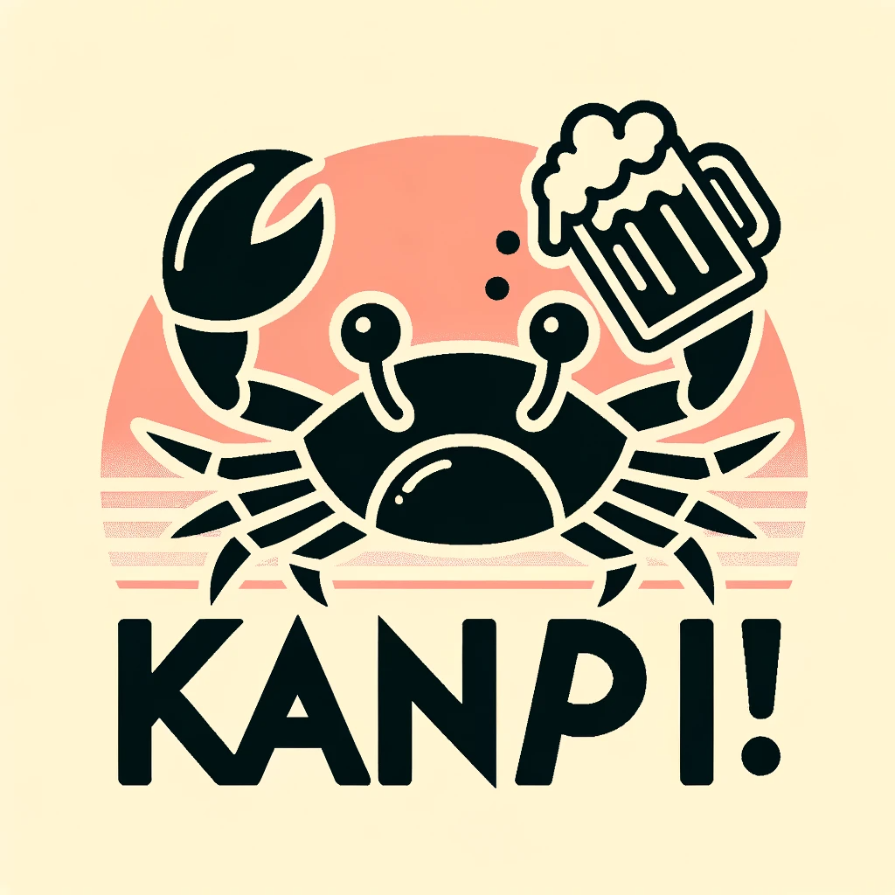

<p align="center">
  
</p>

# kan-pi (乾杯)

kan-pi is an experimental project intended to see how well LLMs with function calling can achieve high-level goals
through delegation and decomposition.

kan-pi uses the kani framework under the hood (kani + raspberry pi = kanpai :beers:)

## Installation

Requires Python 3.10+

```shell
# install python dependencies
$ pip install -r requirements.txt
$ playwright install firefox
# build visualizer
$ cd kanpai-viz
$ npm i
$ npm run build
# run
$ OPENAI_API_KEY="..." python server.py
```

## Core Loop

- Main Kani ingests query, calls do() if need to take an action
- spawn subkani, which can:
  - decompose action into tasks
  - write a new action
    - spawn a code-writing w/ feedback kani
  - retrieve actions from action library
    - spawn a new kani with access to them to complete task

## Code Structure

- Kanpai: app singleton that is responsible for tracking all the kanis
- RootKani: the one the user interacts with, spawns DelegateKanis
- DelegateKani: can do anything:tm:
