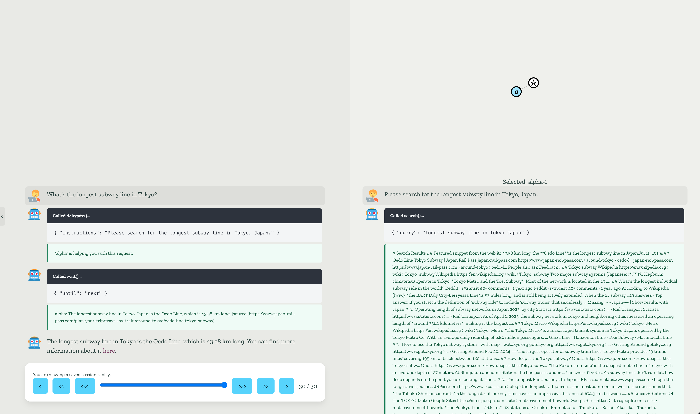

Events & Logging
================
ReDel is an event-driven framework, built around comprehensive logging and ease of instrumentation.

If you're a researcher that wants to observe behaviour nested deep within your system or developer needing to propagate
events up many stack levels, the event framework allows you to easily hook into both application-defined and
custom events you define.

Each event is also logged to a ReDel session's ``events.jsonl`` file, allowing you to use your favorite data analysis
tools to derive metrics from saved sessions.

In this section, we'll cover the default events defined by ReDel, how to listen for them during a run, how to create
and dispatch your own custom events, and how to access and use saved events.

ReDel Events
------------
These are the events you'll see by default when using a ReDel system. Each event comes with a ``type`` field, which
defines what kind of event it is and the other fields available on it, and a ``timestamp`` field, which is the time
the event was generated (in UNIX epoch time).

.. note::
    A ``kani`` is the internal term for an agent node -- the two are equivalent. This comes from ReDel using our
    ``kani`` library under the hood.

.. autoclass:: redel.events.KaniSpawn
    :members:
    :noindex:
    :exclude-members: model_config, model_fields, model_computed_fields
    :class-doc-from: class

.. autoclass:: redel.events.KaniStateChange
    :members:
    :noindex:
    :exclude-members: model_config, model_fields, model_computed_fields
    :class-doc-from: class

.. autoclass:: redel.events.TokensUsed
    :members:
    :noindex:
    :exclude-members: model_config, model_fields, model_computed_fields
    :class-doc-from: class

.. autoclass:: redel.events.KaniMessage
    :members:
    :noindex:
    :exclude-members: model_config, model_fields, model_computed_fields
    :class-doc-from: class

.. autoclass:: redel.events.RootMessage
    :members:
    :noindex:
    :exclude-members: model_config, model_fields, model_computed_fields
    :class-doc-from: class

.. autoclass:: redel.events.RoundComplete
    :members:
    :noindex:
    :exclude-members: model_config, model_fields, model_computed_fields
    :class-doc-from: class

Custom Events
-------------
It's easy to define and dispatch your own custom events, too. A common use case for custom events is when you need to
observe some kind of state within a custom tool. Since tools are dynamically constructed and bound to agent nodes,
it would be awkward to read the state from within a tool instance from outside the system.

Defining Custom Events
^^^^^^^^^^^^^^^^^^^^^^
To define a custom event, you should create a new class that is a subclass of :class:`redel.BaseEvent`. You'll need
to define a custom ``type`` for your event (which should be globally unique - a good practice is to prefix it with
a personal prefix), then define what other fields are present in your event.

Each field should be annotated with a type, and that type must be
`serializable by Pydantic <https://docs.pydantic.dev/latest/concepts/fields/>`_. Primitive and compound Python types
(e.g. ``str``, ``int``, ``list``, ``dict``) are always safe to serialize.

.. code-block:: python
    :caption: Defining a custom event.

    from typing import Literal
    from redel import BaseEvent

    class MyEvent(BaseEvent):
        # this must be present for every custom event, with "my_event" set to your event key
        type: Literal["my_event"] = "my_event"

        # a common practice is to include an `id` field with the ID of the agent the event happened in:
        id: str

        # below, you can add any other data fields needed, as long as each field is serializable by Pydantic
        my_data: str
        my_other_data: SomePydanticModel

    # your custom event's constructor is based on the fields you define:
    MyEvent(id="...", my_data="...", my_other_data=SomePydanticModel(...))

Dispatching Custom Events
^^^^^^^^^^^^^^^^^^^^^^^^^
You can dispatch an event anywhere you have a reference to the :class:`.ReDel` session - most commonly, this is inside
a tool using :attr:`.ToolBase.app`.

Dispatching an event is simple: just call :meth:`.ReDel.dispatch` with an instance of your event. For example, here's
a tool that dispatches an event every time a model calls the function it provides:

.. code-block:: python
    :caption: A tool that dispatches a custom event each time its function is called.
    :emphasize-lines: 15

    from typing import Literal
    from kani import ai_function
    from redel import BaseEvent, ToolBase

    # define a custom event
    class CustomToolEvent(BaseEvent):
        type: Literal["custom_tool_event"] = "custom_tool_event"
        id: str  # the ID of the agent that called the function
        foo: str  # some other data

    # define a tool that dispatches the event
    class MyTool(ToolBase):
        @ai_function()
        def my_cool_function(self):
            self.app.dispatch(CustomToolEvent(id=self.kani.id, foo="bar"))
            # ...

Using Events - Realtime
-----------------------
There are two main ways to use events in real time. The first is the main programmatic entrypoint to a ReDel system,
:meth:`.ReDel.query`. The second is by adding asynchronous event listeners to a ReDel object using
:meth:`.ReDel.add_listener`.

query()
^^^^^^^
Let's take a look back at the minimal script we defined in :doc:`redel`.

.. code-block:: python
    :emphasize-lines: 8

    import asyncio
    from kani import ChatRole
    from redel import ReDel, events

    ai = ReDel()  # configure your system here, or leave blank for a default system

    async def main():
        async for event in ai.query("What is the airspeed velocity of an unladen swallow?"):
            if isinstance(event, events.RootMessage) and event.msg.role == ChatRole.ASSISTANT:
                if event.msg.text:
                    print(event.msg.text)

    asyncio.run(main())

As you can see, :meth:`.ReDel.query` returns an asynchronous iterator of events -- this event stream contains every
single loggable event generated by the system! In this script, we filtered the stream for :class:`.RootMessage` to
print the root node's generated messages, but we can easily call other parts of our code, too.

Example: Token Counting
"""""""""""""""""""""""

For example, let's say we wanted to count how many tokens each of our agents used. We can do this easily by using the
:class:`.TokensUsed` event:

.. code-block:: python
    :caption: Using ReDel.query() to implement token counting using the event system.
    :emphasize-lines: 4-5, 10-12

    # ... imports and defining the ReDel system ...
    from collections import Counter

    tokens_used_prompt = Counter()
    tokens_used_output = Counter()

    async def main():
        async for event in ai.query("What is the airspeed velocity of an unladen swallow?"):
            # ... other event logic here ...
            if isinstance(event, events.TokensUsed):
                tokens_used_prompt[event.id] += event.prompt_tokens
                tokens_used_output[event.id] += event.completion_tokens

    asyncio.run(main())

After our ``main()`` function finishes, the ``tokens_used_prompt`` and ``tokens_used_output`` counters will have counted
exactly how many tokens each node used, and map from node IDs to their token count (int).

Example: Function Call Counting
"""""""""""""""""""""""""""""""

We can do something similar to count the number of times our system called given functions, by listening to the
:class:`.KaniMessage` event:

.. code-block:: python
    :caption: Using ReDel.query() to count the number of calls to given functions.
    :emphasize-lines: 4, 9-11

    # ... imports and defining the ReDel system ...
    from collections import Counter

    function_calls = Counter()

    async def main():
        async for event in ai.query("What is the airspeed velocity of an unladen swallow?"):
            # ... other event logic here ...
            if isinstance(event, events.KaniMessage) and event.message.tool_calls:
                for tool_call in event.message.tool_calls:
                    function_calls[tool_call.function.name] += 1

    asyncio.run(main())

Now, the ``function_calls`` counter maps function names to the number of times they were called in the system.

add_listener()
^^^^^^^^^^^^^^
If you want to programmatically add listeners to multiple different kinds of events or just have a lot of listeners,
your call to ``query()`` might get pretty messy. :meth:`.ReDel.add_listener` provides an alternate method of listening
for events by supplying an async function. The supplied function will be called for each event dispatched by the system.

Ultimately, which method you use is up to you - the two are functionally equivalent.

Here's how you'd use ``add_listener()`` to accomplish the same examples as above:

Example: Token Counting
"""""""""""""""""""""""

.. code-block:: python
    :caption: Using ReDel.add_listener() to implement token counting.
    :emphasize-lines: 4-12

    # ... imports and defining the ReDel system ...
    from collections import Counter

    tokens_used_prompt = Counter()
    tokens_used_output = Counter()

    async def token_count_listener(event):
        if isinstance(event, events.TokensUsed):
            tokens_used_prompt[event.id] += event.prompt_tokens
            tokens_used_output[event.id] += event.completion_tokens

    ai.add_listener(token_count_listener)

    async def main():
        async for event in ai.query("What is the airspeed velocity of an unladen swallow?"):
            # ... main event logic here ...

    asyncio.run(main())

After our ``main()`` function finishes, the ``tokens_used_prompt`` and ``tokens_used_output`` counters will have the
exact same results as if we had put the token counting logic in the main ``query()`` body.

Example: Function Call Counting
"""""""""""""""""""""""""""""""

.. code-block:: python
    :caption: Using ReDel.add_listener() to count the number of calls to given functions.
    :emphasize-lines: 4-11

    # ... imports and defining the ReDel system ...
    from collections import Counter

    function_calls = Counter()

    async def function_call_listener(event):
        if isinstance(event, events.KaniMessage) and event.message.tool_calls:
            for tool_call in event.message.tool_calls:
                function_calls[tool_call.function.name] += 1

    ai.add_listener(function_call_listener)

    async def main():
        async for event in ai.query("What is the airspeed velocity of an unladen swallow?"):
            # ... main event logic here ...

    asyncio.run(main())

Using Saved Events
------------------
ReDel automatically saves all events dispatched by a system to its ``log_dir`` in JSONL format, so it's easy to
run data analysis post-hoc. By default, a system's ``log_dir`` will be ``$REDEL_HOME/instances/{session_id}/``, with
the ``$REDEL_HOME`` environment variable defaulting to ``~/.redel``. The events will be stored in the ``events.jsonl``
file.

ReDel provides the :func:`.read_jsonl` utility to read a stream of events from this file.

.. attention::
    Events read from this file will all be ``dict``, rather than the event type they were created as.

Example: Token Counting
^^^^^^^^^^^^^^^^^^^^^^^
For example, let's say we've completed a run of our ReDel system but didn't count the tokens in real-time. We can
read the event log to accomplish this post-hoc as easily as in real-time, with only a small modification to the code:

.. code-block:: python
    :caption: Using the saved event log to implement token counting.

    from collections import Counter
    from redel.utils import read_jsonl

    tokens_used_prompt = Counter()
    tokens_used_output = Counter()

    for event in read_jsonl("/path/to/saved/events.jsonl"):
        if event["type"] == "tokens_used":
            tokens_used_prompt[event["id"]] += event["prompt_tokens"]
            tokens_used_output[event["id"]] += event["completion_tokens"]

Of course, JSONL is an application-agnostic format - you can load it in your favorite data analysis tool and programming
language and analyze your results however you want!

Example events.jsonl
--------------------
Here's an example of an ``events.jsonl`` file's contents.

.. code-block:: json

    {"type":"kani_spawn","timestamp":1721343880.026685,"id":"c756b225-858b-489d-81c4-3035b7c54017","depth":0,"parent":null,"children":[],"always_included_messages":[{"role":"system","content":"# Goals\n\nYour goal is to answer the user's questions and help them out by performing actions. While you may be able to answer many questions from memory alone, the user's queries will sometimes require you to search on the Internet or take actions. You can use the provided function to ask your capable helpers, who can help you search the Internet and take actions. You should include any links they used in your response.\nThe current time is {time}.","name":null,"tool_call_id":null,"tool_calls":null,"is_tool_call_error":null}],"chat_history":[],"state":"stopped","name":"root","engine_type":"OpenAIEngine","engine_repr":"OpenAIEngine(model=gpt-4, max_context_size=8192, hyperparams={'temperature': 0.8, 'top_p': 0.95})","functions":[{"name":"delegate","desc":"Ask a capable helper for help looking up a piece of information or performing an action.\nUse wait() to get a helper's result.\nYou can call this multiple times to take multiple actions.\nYou should break up user queries into multiple smaller queries if possible.\nDo not delegate the entire task you were given.\nIf the user's query can be resolved in parallel, call this multiple times then use wait(\"all\").","auto_retry":true,"auto_truncate":null,"after":"assistant","json_schema":{"properties":{"instructions":{"description":"Detailed instructions on what your helper should do to help you. This should include all the information the helper needs.","type":"string"},"who":{"default":null,"description":"If you need to ask a previous helper a follow-up, pass their name here; otherwise omit.","type":"string"}},"required":["instructions"],"type":"object"}},{"name":"wait","desc":"Wait for a helper to finish their task and get their result.","auto_retry":true,"auto_truncate":6000,"after":"assistant","json_schema":{"properties":{"until":{"description":"The name of the helper. Pass \"next\" for the next helper, or \"all\" for all running helpers.","type":"string"}},"required":["until"],"type":"object"}}]}
    {"type":"kani_state_change","timestamp":1721343880.026808,"id":"c756b225-858b-489d-81c4-3035b7c54017","state":"running"}
    {"type":"kani_message","timestamp":1721343880.0268312,"id":"c756b225-858b-489d-81c4-3035b7c54017","msg":{"role":"user","content":"What's the longest subway line in Tokyo?","name":null,"tool_call_id":null,"tool_calls":null,"is_tool_call_error":null}}
    {"type":"root_message","timestamp":1721343880.026836,"msg":{"role":"user","content":"What's the longest subway line in Tokyo?","name":null,"tool_call_id":null,"tool_calls":null,"is_tool_call_error":null}}
    {"type":"kani_message","timestamp":1721343881.686901,"id":"c756b225-858b-489d-81c4-3035b7c54017","msg":{"role":"assistant","content":null,"name":null,"tool_call_id":null,"tool_calls":[{"id":"call_j57cEuAvWdw8z41OCpcEGmSq","type":"function","function":{"name":"delegate","arguments":"{\n  \"instructions\": \"Please search for the longest subway line in Tokyo, Japan.\"\n}"}}],"is_tool_call_error":null}}
    {"type":"root_message","timestamp":1721343881.6869628,"msg":{"role":"assistant","content":null,"name":null,"tool_call_id":null,"tool_calls":[{"id":"call_j57cEuAvWdw8z41OCpcEGmSq","type":"function","function":{"name":"delegate","arguments":"{\n  \"instructions\": \"Please search for the longest subway line in Tokyo, Japan.\"\n}"}}],"is_tool_call_error":null}}
    {"type":"tokens_used","timestamp":1721343881.6869912,"id":"c756b225-858b-489d-81c4-3035b7c54017","prompt_tokens":337,"completion_tokens":24}
    {"type":"kani_spawn","timestamp":1721343881.706909,"id":"c43a3a60-990c-44b4-b1ce-77b2fea195e2","depth":1,"parent":"c756b225-858b-489d-81c4-3035b7c54017","children":[],"always_included_messages":[{"role":"system","content":"You are {name}, a helpful assistant with the goal of answering the user's questions as precisely as possible and helping them out by performing actions.\nYou can use the provided functions to search the Internet or ask your capable helpers, who can help you take actions.\nIf the user's query involves multiple steps, you should break it up into smaller pieces and delegate those pieces - for example, if you need to look up multiple sites, delegate each search to a helper. Say your plan before you do. If those pieces can be resolved at the same time, delegate them all at once and use wait(\"all\"). You may do multiple rounds of delegating and waiting for additional steps that depend on earlier steps.\nYou should include any links you used in your response.\nThe current time is {time}.","name":null,"tool_call_id":null,"tool_calls":null,"is_tool_call_error":null}],"chat_history":[],"state":"stopped","name":"alpha","engine_type":"OpenAIEngine","engine_repr":"OpenAIEngine(model=gpt-4, max_context_size=8192, hyperparams={'temperature': 0.8, 'top_p': 0.95})","functions":[{"name":"delegate","desc":"Ask a capable helper for help looking up a piece of information or performing an action.\nUse wait() to get a helper's result.\nYou can call this multiple times to take multiple actions.\nYou should break up user queries into multiple smaller queries if possible.\nDo not delegate the entire task you were given.\nIf the user's query can be resolved in parallel, call this multiple times then use wait(\"all\").","auto_retry":true,"auto_truncate":null,"after":"assistant","json_schema":{"properties":{"instructions":{"description":"Detailed instructions on what your helper should do to help you. This should include all the information the helper needs.","type":"string"},"who":{"default":null,"description":"If you need to ask a previous helper a follow-up, pass their name here; otherwise omit.","type":"string"}},"required":["instructions"],"type":"object"}},{"name":"wait","desc":"Wait for a helper to finish their task and get their result.","auto_retry":true,"auto_truncate":6000,"after":"assistant","json_schema":{"properties":{"until":{"description":"The name of the helper. Pass \"next\" for the next helper, or \"all\" for all running helpers.","type":"string"}},"required":["until"],"type":"object"}},{"name":"search","desc":"Search a query on Google.","auto_retry":true,"auto_truncate":null,"after":"assistant","json_schema":{"properties":{"query":{"type":"string"}},"required":["query"],"type":"object"}},{"name":"visit_page","desc":"Visit a web page and view its contents.","auto_retry":true,"auto_truncate":null,"after":"assistant","json_schema":{"properties":{"href":{"type":"string"}},"required":["href"],"type":"object"}}]}
    {"type":"kani_state_change","timestamp":1721343881.707008,"id":"c43a3a60-990c-44b4-b1ce-77b2fea195e2","state":"running"}
    {"type":"kani_message","timestamp":1721343881.707029,"id":"c43a3a60-990c-44b4-b1ce-77b2fea195e2","msg":{"role":"user","content":"Please search for the longest subway line in Tokyo, Japan.","name":null,"tool_call_id":null,"tool_calls":null,"is_tool_call_error":null}}
    {"type":"kani_message","timestamp":1721343881.713737,"id":"c756b225-858b-489d-81c4-3035b7c54017","msg":{"role":"function","content":"'alpha' is helping you with this request.","name":"delegate","tool_call_id":"call_j57cEuAvWdw8z41OCpcEGmSq","tool_calls":null,"is_tool_call_error":false}}
    {"type":"root_message","timestamp":1721343881.713744,"msg":{"role":"function","content":"'alpha' is helping you with this request.","name":"delegate","tool_call_id":"call_j57cEuAvWdw8z41OCpcEGmSq","tool_calls":null,"is_tool_call_error":false}}
    {"type":"kani_message","timestamp":1721343882.785106,"id":"c756b225-858b-489d-81c4-3035b7c54017","msg":{"role":"assistant","content":null,"name":null,"tool_call_id":null,"tool_calls":[{"id":"call_KNrskGbssBcURcShQ6DWH5qP","type":"function","function":{"name":"wait","arguments":"{\n  \"until\": \"next\"\n}"}}],"is_tool_call_error":null}}
    {"type":"root_message","timestamp":1721343882.78514,"msg":{"role":"assistant","content":null,"name":null,"tool_call_id":null,"tool_calls":[{"id":"call_KNrskGbssBcURcShQ6DWH5qP","type":"function","function":{"name":"wait","arguments":"{\n  \"until\": \"next\"\n}"}}],"is_tool_call_error":null}}
    {"type":"tokens_used","timestamp":1721343882.7851572,"id":"c756b225-858b-489d-81c4-3035b7c54017","prompt_tokens":378,"completion_tokens":14}
    {"type":"kani_state_change","timestamp":1721343882.7857149,"id":"c756b225-858b-489d-81c4-3035b7c54017","state":"waiting"}
    {"type":"kani_message","timestamp":1721343883.609167,"id":"c43a3a60-990c-44b4-b1ce-77b2fea195e2","msg":{"role":"assistant","content":null,"name":null,"tool_call_id":null,"tool_calls":[{"id":"call_Qxqq0HLf1Mu9vo8QTQTLEOHA","type":"function","function":{"name":"search","arguments":"{\n  \"query\": \"longest subway line in Tokyo Japan\"\n}"}}],"is_tool_call_error":null}}
    {"type":"tokens_used","timestamp":1721343883.609196,"id":"c43a3a60-990c-44b4-b1ce-77b2fea195e2","prompt_tokens":453,"completion_tokens":20}
    {"type":"kani_message","timestamp":1721343888.1894531,"id":"c43a3a60-990c-44b4-b1ce-77b2fea195e2","msg":{"role":"function","content":"# Search Results\n## Featured snippet from the web\nAt 43.58 km long, the\n\n**Oedo Line**is the longest subway line in Japan.Jul 11, 2019### Oedo Line Tokyo Subway | Japan Rail Pass\njapan-rail-pass.com\n\nhttps://www.japan-rail-pass.com › around-tokyo › oedo-l...\n\njapan-rail-pass.com\n\nhttps://www.japan-rail-pass.com › around-tokyo › oedo-l...\n\nPeople also ask\n\nFeedback\n\n### Tokyo subway\nWikipedia\n\nhttps://en.wikipedia.org › wiki › Tokyo_subway\n\nWikipedia\n\nhttps://en.wikipedia.org › wiki › Tokyo_subway\n\nTwo major subway systems (Japanese: 地下鉄, Hepburn: chikatetsu) operate in Tokyo:\n\n*Tokyo Metro and the Toei Subway*. Most of the network is located in the 23 ...### What's the longest individual subway ride in the world?\nReddit · r/transit\n\n40+ comments · 1 year ago\n\nReddit · r/transit\n\n40+ comments · 1 year ago\n\nAccording to Wikipedia (fwiw),\n\n*the BART Daly City-Berryessa Line*is 53 miles long, and is still being actively extended. When the SJ subway ...19 answers · Top answer: If you stretch the definition of “subway ride” to include ‘subway trains’ that seamlessly ...\n\nMissing: ~~Japan~~ | Show results with: Japan\n\n### Operating length of subway networks in Japan 2023, by city\nStatista\n\nhttps://www.statista.com › ... › Rail Transport\n\nStatista\n\nhttps://www.statista.com › ... › Rail Transport\n\nAs of April 1, 2023, the subway network in Tokyo and neighboring cities measured an operating length of\n\n*around 356.1 kilometers*, making it the largest ...### Tokyo Metro\nWikipedia\n\nhttps://en.wikipedia.org › wiki › Tokyo_Metro\n\nWikipedia\n\nhttps://en.wikipedia.org › wiki › Tokyo_Metro\n\n*The Tokyo Metro*is a major rapid transit system in Tokyo, Japan, operated by the Tokyo Metro Co. With an average daily ridership of 6.84 million passengers, ...\nGinza Line · Hanzōmon Line · Toei Subway · Marunouchi Line\n\n### How to use the Tokyo subway system - with map - Gotokyo.org\ngotokyo.org\n\nhttps://www.gotokyo.org › ... › Getting Around\n\ngotokyo.org\n\nhttps://www.gotokyo.org › ... › Getting Around\n\nFeb 20, 2024 — The largest operator of subway train lines, Tokyo Metro provides\n\n*9 trains lines*covering 195 km of track between 180 stations.### How deep is the Tokyo subway?\nQuora\n\nhttps://www.quora.com › How-deep-is-the-Tokyo-subw...\n\nQuora\n\nhttps://www.quora.com › How-deep-is-the-Tokyo-subw...\n\n*The Fukutoshin Line*is the deepest metro line in Tokyo, with an average depth of 27 meters. At Shinjuku-sanchōme Station, the line passes under ...\n1 answer · 11 votes: As subway lines don’t run flat, how deep depends on the point you are looking at.\nThe ...\n\n### The Longest Rail Journeys In Japan\nJRPass.com\n\nhttps://www.jrpass.com › blog › the-longest-rail-journe...\n\nJRPass.com\n\nhttps://www.jrpass.com › blog › the-longest-rail-journe...\n\nThe most common answer to the question is that\n\n*the Tohoku Shinkansen route*is the longest rail journey. This covers an impressive distance of 674.9 km between ...### Lines & Stations Of The TOKYO Metro\nGoogle Sites\n\nhttps://sites.google.com › site › metrosystemsoftheworld\n\nGoogle Sites\n\nhttps://sites.google.com › site › metrosystemsoftheworld\n\n*The Fujikyu Line - 26.6 km*- 18 stations at Otsuku - Kamiotsuku - Tanokura - Kasei - Akasaka - Tsurushu - Yamuramachi - Tsuru Bunkadaigaku Mae - Tōkaichiba - ...\nSelect an image to give feedback\n\nFeedback\n\n6 more images\n\nYou should visit some of these links for more information or delegate helpers to visit multiple:\n\n===== Links =====\n[Oedo Line Tokyo Subway | Japan Rail Pass\njapan-rail-pass.com\nhttps://www.japan-rail-pass.com › around-tokyo › oedo-l...](https://www.japan-rail-pass.com/plan-your-trip/travel-by-train/around-tokyo/oedo-line-tokyo-subway)\n[About featured snippets](https://www.google.com/url?url=https://support.google.com/websearch?p%3Dfeatured_snippets%26hl%3Den-US&rct=j&q=&esrc=s&opi=89978449&usg=AOvVaw0i6agUwizJt0H2lHOHxNHI&hl=en&sa=X&ved=2ahUKEwjsvLvX2bGHAxVVFDQIHe5tCQEQrpwBegQIHBAC)\n[Tokyo subway\nWikipedia\nhttps://en.wikipedia.org › wiki › Tokyo_subway](https://en.wikipedia.org/wiki/Tokyo_subway)\n[What's the longest individual subway ride in the world?\nReddit · r/transit\n40+ comments · 1 year ago](https://www.reddit.com/r/transit/comments/zm8g9y/whats_the_longest_individual_subway_ride_in_the/)\n[Long train rides where you don't need go change lines : r/Tokyo](https://www.reddit.com/r/Tokyo/comments/j0jbsc/long_train_rides_where_you_dont_need_go_change/)\n[Which metro system has the longest trains? : r/transit - Reddit](https://www.reddit.com/r/transit/comments/o2vjkx/which_metro_system_has_the_longest_trains/)\n[How does the through-running on japanese subways work?](https://www.reddit.com/r/transit/comments/1blske0/how_does_the_throughrunning_on_japanese_subways/)\n[This is the Tokyo Metro to scale compared with downtown Los ...](https://www.reddit.com/r/transit/comments/18ga408/this_is_the_tokyo_metro_to_scale_compared_with/)\n[More results from www.reddit.com](https://www.google.com/search?q=longest+subway+line+in+Tokyo+Japan+site%3Awww.reddit.com)\n[Japan](https://www.google.com/search?q=longest+subway+line+in+Tokyo+%22Japan%22)\n[Operating length of subway networks in Japan 2023, by city\nStatista\nhttps://www.statista.com › ... › Rail Transport](https://www.statista.com/statistics/1314969/japan-operating-length-subway-networks-by-city/)\n[Tokyo Metro\nWikipedia\nhttps://en.wikipedia.org › wiki › Tokyo_Metro](https://en.wikipedia.org/wiki/Tokyo_Metro)\n[Ginza Line](https://en.wikipedia.org/wiki/Tokyo_Metro_Ginza_Line)\n[Hanzōmon Line](https://en.wikipedia.org/wiki/Tokyo_Metro_Hanz%C5%8Dmon_Line)\n[Toei Subway](https://en.wikipedia.org/wiki/Toei_Subway)\n[Marunouchi Line](https://en.wikipedia.org/wiki/Tokyo_Metro_Marunouchi_Line)\n[How to use the Tokyo subway system - with map - Gotokyo.org\ngotokyo.org\nhttps://www.gotokyo.org › ... › Getting Around](https://www.gotokyo.org/en/plan/getting-around/subways/index.html)\n[longest](https://www.google.com/search?q=%22longest%22+subway+line+in+Tokyo+Japan)\n[How deep is the Tokyo subway?\nQuora\nhttps://www.quora.com › How-deep-is-the-Tokyo-subw...](https://www.quora.com/How-deep-is-the-Tokyo-subway)\n[1 answer](https://www.quora.com/How-deep-is-the-Tokyo-subway?top_ans=335170279)\n[The Longest Rail Journeys In Japan\nJRPass.com\nhttps://www.jrpass.com › blog › the-longest-rail-journe...](https://www.jrpass.com/blog/the-longest-rail-journeys-in-japan)\n[Lines & Stations Of The TOKYO Metro\nGoogle Sites\nhttps://sites.google.com › site › metrosystemsoftheworld](https://sites.google.com/site/metrosystemsoftheworld/Lines--Stations-Of-The-Tokyo-Metro)\n[Images](https://www.google.com/search?q=longest+subway+line+in+Tokyo+Japan)\n[Inclusive design on the Tokyo subway || Matthew Ström ...\nMatthew Ström](https://matthewstrom.com/writing/inclusive-subway-design/)\n[Journeys Below Ground – The Tokyo Subway System\nUnmissable Japan](http://www.unmissablejapan.com/underground/journeys-below-ground)","name":"search","tool_call_id":"call_Qxqq0HLf1Mu9vo8QTQTLEOHA","tool_calls":null,"is_tool_call_error":false}}
    {"type":"kani_message","timestamp":1721343891.1760771,"id":"c43a3a60-990c-44b4-b1ce-77b2fea195e2","msg":{"role":"assistant","content":"The longest subway line in Tokyo, Japan is the Oedo Line, which is 43.58 km long. [source](https://www.japan-rail-pass.com/plan-your-trip/travel-by-train/around-tokyo/oedo-line-tokyo-subway)","name":null,"tool_call_id":null,"tool_calls":[],"is_tool_call_error":null}}
    {"type":"tokens_used","timestamp":1721343891.176119,"id":"c43a3a60-990c-44b4-b1ce-77b2fea195e2","prompt_tokens":2466,"completion_tokens":60}
    {"type":"kani_state_change","timestamp":1721343891.176377,"id":"c43a3a60-990c-44b4-b1ce-77b2fea195e2","state":"stopped"}
    {"type":"kani_state_change","timestamp":1721343891.186143,"id":"c756b225-858b-489d-81c4-3035b7c54017","state":"running"}
    {"type":"kani_message","timestamp":1721343891.186749,"id":"c756b225-858b-489d-81c4-3035b7c54017","msg":{"role":"function","content":"alpha:\nThe longest subway line in Tokyo, Japan is the Oedo Line, which is 43.58 km long. [source](https://www.japan-rail-pass.com/plan-your-trip/travel-by-train/around-tokyo/oedo-line-tokyo-subway)","name":"wait","tool_call_id":"call_KNrskGbssBcURcShQ6DWH5qP","tool_calls":null,"is_tool_call_error":false}}
    {"type":"root_message","timestamp":1721343891.186761,"msg":{"role":"function","content":"alpha:\nThe longest subway line in Tokyo, Japan is the Oedo Line, which is 43.58 km long. [source](https://www.japan-rail-pass.com/plan-your-trip/travel-by-train/around-tokyo/oedo-line-tokyo-subway)","name":"wait","tool_call_id":"call_KNrskGbssBcURcShQ6DWH5qP","tool_calls":null,"is_tool_call_error":false}}
    {"type":"kani_message","timestamp":1721343893.8424692,"id":"c756b225-858b-489d-81c4-3035b7c54017","msg":{"role":"assistant","content":"The longest subway line in Tokyo is the Oedo Line, which is 43.58 km long. You can find more information about it [here](https://www.japan-rail-pass.com/plan-your-trip/travel-by-train/around-tokyo/oedo-line-tokyo-subway).","name":null,"tool_call_id":null,"tool_calls":[],"is_tool_call_error":null}}
    {"type":"root_message","timestamp":1721343893.842486,"msg":{"role":"assistant","content":"The longest subway line in Tokyo is the Oedo Line, which is 43.58 km long. You can find more information about it [here](https://www.japan-rail-pass.com/plan-your-trip/travel-by-train/around-tokyo/oedo-line-tokyo-subway).","name":null,"tool_call_id":null,"tool_calls":[],"is_tool_call_error":null}}
    {"type":"tokens_used","timestamp":1721343893.842498,"id":"c756b225-858b-489d-81c4-3035b7c54017","prompt_tokens":460,"completion_tokens":65}
    {"type":"kani_state_change","timestamp":1721343893.842766,"id":"c756b225-858b-489d-81c4-3035b7c54017","state":"stopped"}
    {"type":"round_complete","timestamp":1721343893.842787,"session_id":"1721343880-b061a234-4613-4c15-97e8-27d885035f88"}

This corresponds to the following session, with a user query spawning one sub-agent that performs a web search:

