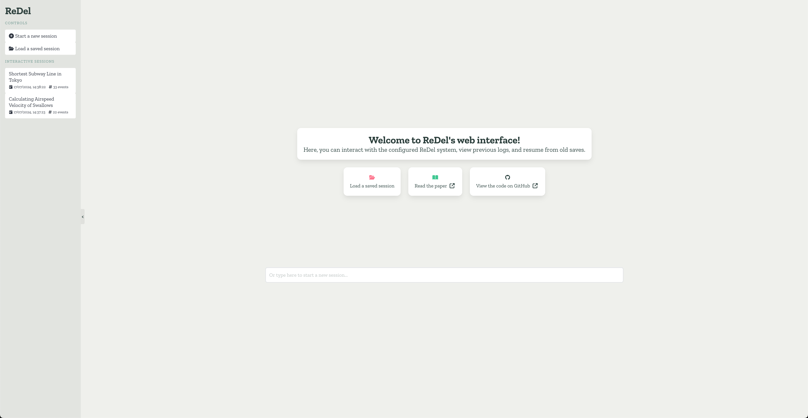
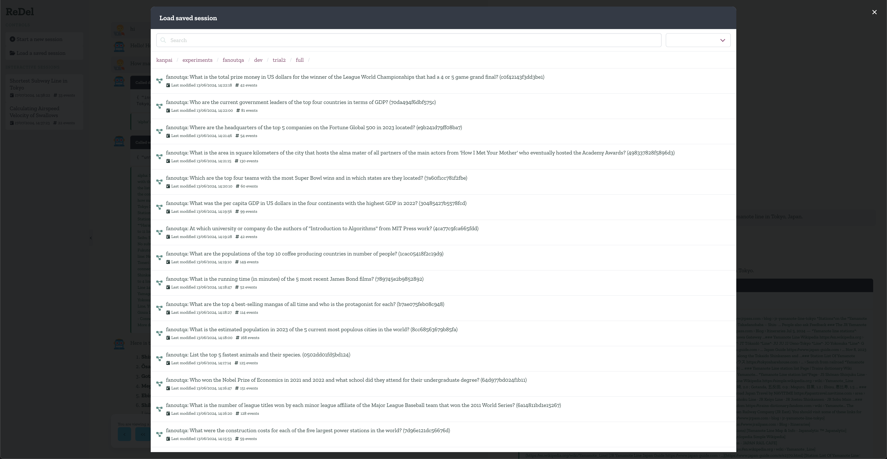
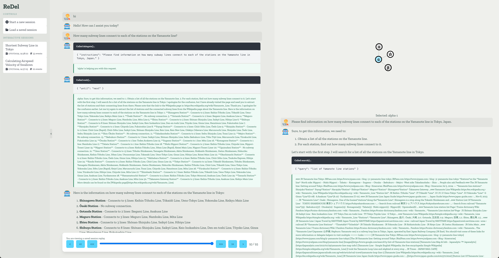

ReDel
=====

ReDel is a toolkit for researchers and developers to build, iterate on, and analyze recursive multi-agent systems.

Built using the `kani <https://kani.readthedocs.io/en/latest/>`_ framework, it offers best-in-class support for modern
LLMs with tool usage.

Features
--------

- **Modular design** - ReDel makes it easy to experiment by providing a modular interface for creating tools, different
  delegation methods, and logs for later analysis.
- **Event-driven architecture** - Granular logging and a central event system makes it easy to listen for signals
  from anywhere in your system. Every event is automatically logged so you can run your favorite data analysis tools.
- **Bundled visualization** - Multi-agent systems can be hard to reason about from a human perspective. We provide a
  web-based visualization that allows you to interact with a configured system directly or view replays of saved runs
  (e.g. your own experiments!).
- **Built with open, unopinionated tech** - ReDel won't force you to learn bizarre library-specific tooling and isn't
  built by a big tech organization with their own motives. Everything in ReDel is implemented in pure, idiomatic Python
  and permissively licensed.

Screenshots
-----------

.. image:: _static/delegate2.png

Quickstart
----------

Want to see what ReDel can do? To get started, we'll set up a ReDel instance with web browsing enabled.

You'll need Python 3.10 or higher. First, you'll need to install the library:

.. code-block:: console

    $ pip install "redel[all]"
    $ playwright install chromium

Then, use the following code as a starting point in a new file (e.g. ``server.py``). This snippet defines the LLM engine
your agents will use, what tools they have available, and serves the system configuration over your local interface.

.. code-block:: python

    from kani.engines.openai import OpenAIEngine
    from redel import ReDel
    from redel.server import VizServer
    from redel.tools.browsing import Browsing

    # Define the LLM engines to use for each node
    engine = OpenAIEngine(model="gpt-4", temperature=0.8, top_p=0.95)

    # Define the configuration for each interactive session
    redel_proto = ReDel(
        root_engine=engine,
        delegate_engine=engine,
        tool_configs={
            Browsing: {"always_include": True},
        },
    )

    # configure and start the server
    server = VizServer(redel_proto)
    server.serve()

Next, define your OpenAI API key (if you're using an OpenAI model) and start the server:

.. code-block:: console

    $ OPENAI_API_KEY="..." python server.py

Finally, open http://127.0.0.1:8000 in your browser. You'll be able to start new chats with a ReDel instance configured
with a web browsing tool!

For more information about ReDel and its concepts, keep reading!

.. toctree::
    :maxdepth: 2
    :caption: Docs

    install
    redel
    tools
    delegation
    events
    viz
    experiments.md
    glossary
    api_reference
    genindex
