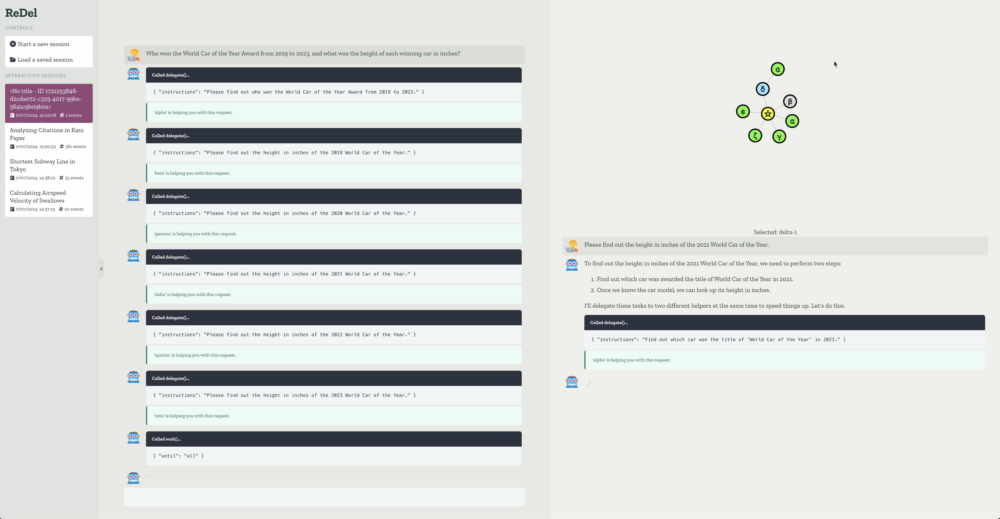

ReDel
=====

ReDel is a toolkit for researchers and developers to build, iterate on, and analyze recursive multi-agent systems.

It consists of two main parts: a Python library for building, running, and logging systems, and a web visualizer
to view system logs and interact with systems in a sandbox environment.

.. video:: _static/demo1.webm

What is a recursive multi-agent system?
---------------------------------------

A **multi-agent system** is an application that uses multiple large language models (LLMs) working together to
accomplish complex tasks or answer complex questions beyond the capabilities of a single LLM. In most cases, each LLM
is provided with **tools** that it can use to give it additional capabilities, like searching the internet for real-time
data.

Often, these systems are defined manually, with a human responsible for defining a rigid graph of agents and defining
each agent's role and responsibilities (usually through a prompt).

A **recursive** multi-agent system takes this one step further -- rather than a human defining the layout of multiple
agents, a recursive system gives a single **root** agent a tool to spawn additional agents. When faced with a complex
task, the root agent decomposes the task into smaller subtasks, then **delegates** those tasks to sub-agents. Each
sub-agent can then either complete the task if it is small enough, or recursively decompose and delegate the task
further.

.. note::
    This is where the toolkit's name, ReDel, comes from: it's short for **Re**\ cursive **Del**\ egation.

In the rest of this documentation, you'll learn how to use ReDel to define new tools, define delegation schemes, build
recursive multi-agent systems, and interact with the systems you've built.

The ReDel Class
---------------

The ReDel class is the main class in the Python library, and the parameters you pass to it control what LLM(s) the
system uses, what tools it has available, how it delegates tasks, and where it logs events.

It's pretty formidable and we've copied the constructor's docs here. Below, we'll break it down and talk about each
part.

.. autoclass:: redel.ReDel
    :noindex:

**So what do all of these parameters mean?**

First, you should be familiar with the concept of root and delegate agents. Every ReDel system has exactly one **root**
agents: it's the only agents that exists at first, and the one a human user interacts with. Usually, it's responsible
for decomposing and delegating tasks to **delegate** agents (which are all other than the root). This creates a tree of
agents, with tasks getting more and more granular as you go further down the tree.

With that in mind, we can break down the parameter list into groups.

Kani Arguments
^^^^^^^^^^^^^^

Engines
"""""""
The ``root_engine`` and ``delegate_engine`` are the LLMs that the root agent and delegate agents will use, respectively.
These take the form of Kani :external+kani:doc:`engines`, which means that they are interchangeable and use a consistent
interface regardless of the underlying LLM (see the :external+kani:doc:`Kani documentation <engines>` for more details).

If not set, the default engine is ``gpt-4o`` with ``temperature=0.8, top_p=0.95``:

.. code-block:: python

    from kani.engines.openai import OpenAIEngine
    OpenAIEngine(model="gpt-4o", temperature=0.8, top_p=0.95)

Prompts
"""""""
The ``root_system_prompt`` and ``delegate_system_prompt`` will be sent, as system messages, to every request to each
root and delegate agent, respectively. By default, these are:

**root**

    # Goals

    Your goal is to answer the user's questions and help them out by performing actions. While you may be able to answer
    many questions from memory alone, the user's queries will sometimes require you to take actions. You can use the
    provided function to ask your capable helpers, who can help you take actions.
    The current time is {time}.

**delegate**

    You are {name}, a helpful assistant with the goal of answering the user's questions as precisely as possible and
    helping them out by performing actions.
    You can use the provided functions to take actions yourself or break queries up into smaller pieces and ask your
    capable helpers, who can help you.
    If the user's query involves multiple steps, you should break it up into smaller pieces and delegate those pieces
    - for example, if you need to look up multiple sites, delegate each search to a helper. Say your plan before you do.
    If those pieces can be resolved at the same time, delegate them all at once. You may do multiple rounds of
    delegating for additional steps that depend on earlier steps.
    The current time is {time}.

The strings ``{name}`` and ``{time}`` will be replaced with an agent's name (see :class:`.BaseKani`) and the current
date and time respectively for each request to the LLM.

Additional Kani Arguments
"""""""""""""""""""""""""
To further control each agent, you can also pass ``root_kani_kwargs`` and ``delegate_kani_kwargs``, which will be passed
to each root and delegate's kani's constructor. To see a list of valid arguments, see :external+kani:class:`kani.Kani`
(note that ``engine`` and ``system_prompt`` have their own dedicated arguments as part of ReDel).

Delegation Configuration
^^^^^^^^^^^^^^^^^^^^^^^^
The ``delegation_scheme`` is a class that should provide a ``delegate()`` function. The class should inherit from
:class:`.DelegationBase`. For more information on the included delegation schemes and how to define your own delegation
schemes, see :doc:`delegation`.

``max_delegation_depth`` controls how many layers of delegation the system is allowed to do (i.e., the depth of the
agent tree). ReDel disables delegation by removing the ``delegate()`` function from an agent's list of available tools
when this limit is reached.

.. _tool_config:

Tool Configuration
^^^^^^^^^^^^^^^^^^
``tool_configs`` is a dictionary, where the keys are *classes* and the values are their configurations
(:class:`.ToolConfig`). Specifically, each key is a class that defines a tool: a group of functions that can be exposed
to an agent. This class should inherit from :class:`.ToolBase`. For more information about the included tools and how
to define your own tools, see :doc:`tools`.

The tool configuration determines which agents have access to the tool and what arguments to call the tool constructor
with. We recommend not giving the root agent access to any tools, as the root agent is prone to overcommitting instead
of delegating when faced with a complex task.

An example of a tool configuration that gives all delegate agents access to the included web browsing tool is:

.. code-block:: python

    from redel.tools.browsing import Browsing

    sys = ReDel(
        ...,
        tool_configs={
            Browsing: {
                "always_include": True,
                "kwargs": {"long_engine": long_engine},  # long_engine defined somewhere else
            },
        },
    )

.. note::
    In a future version, tools will be retrieved instead of always included or excluded, hence why they must
    be explicitly included in the current version to avoid breaking changes.

If ``root_has_tools`` is ``True``, the root agent will have access to all of the same tools each delegate agent has
access to, *in addition to* any tools with ``always_include_root`` set to ``True``.

Logging Configuration
^^^^^^^^^^^^^^^^^^^^^
ReDel automatically logs each run of a ReDel system, allowing researchers and developers to easily analyze system
outputs and introspect internal behaviour. These arguments configure where these logs are saved and other logging
behaviour. To learn more about the logging, see :doc:`events`.

``title`` is a human-readable title for the system's run. This allows you to search previous sessions in the web
visualizer.
You can set this to the special value ``redel.AUTOGENERATE_TITLE`` in order to have an LLM generate the title after
a couple rounds of interaction, which is particularly useful for web-based interactive sessions.

``log_dir`` is the directory where the session's events should be saved. ReDel will create a new save the system's event
logs and final state as ``events.jsonl`` and ``state.json`` in this directory.

If the ``log_dir`` already contains an existing save, ``clear_existing_log`` controls whether new events should be
appended to an existing ``events.jsonl`` file or if the file should be truncated before writing events. This should be
``True`` if the session does not load the existing save (e.g. rerunning an experiment from scratch) and ``False`` if it
does (e.g. continuing an interactive session).

Interacting with a ReDel System
-------------------------------
Now that we know how to configure a system, how do we actually use it?

There are two primary ways to interact with a system now that you've configured it: interactively, through the web
interface, or programmatically. The former is particularly useful to debug your system's behaviour, iterate on prompts,
or otherwise provide an interactive experience. The latter is useful for running experiments and batch queries.

Serving for Web Interface
^^^^^^^^^^^^^^^^^^^^^^^^^
To serve a ReDel configuration using the included web interface, the library includes the :class:`.VizServer` class.

This class takes a :class:`.ReDel` instance and will make copies of it to serve interactive chats.

.. code-block:: python
    :caption: An example of serving a ReDel configuration with web browsing over the web interface.

    from kani.engines.openai import OpenAIEngine
    from redel import Redel
    from redel.server import VizServer
    from redel.tools.browsing import Browsing

    # configure your LLMs - see the Kani engine documentation for more info
    root_engine = OpenAIEngine(model="gpt-4o", temperature=0.8, top_p=0.95)
    delegate_engine = OpenAIEngine(model="gpt-3.5-turbo", temperature=0.8, top_p=0.95)

    # a ReDel session configuration, acting as a prototype for interactive sessions
    redel_proto = ReDel(
        root_engine=root_engine,
        delegate_engine=delegate_engine,
        tool_configs={
            Browsing: {
                "always_include": True,
                "kwargs": {"long_engine": long_engine},
            },
        },
    )

    # pass the prototype to VizServer
    server = VizServer(redel_proto)

    # VizServer.serve() makes the web interface available at 127.0.0.1:8000 by default
    server.serve()

This will allow you to chat with the current configuration and visualize the computation tree:

See :doc:`viz` for more information about the web interface.

Programmatic
^^^^^^^^^^^^
Otherwise, to use a ReDel configuration in a larger program, you should use :meth:`.ReDel.query` to send queries
to the root node. This method will return an iterator of events that the system emits -- you can use this to listen
for specific events, or filter the stream for :class:`.events.RootMessage` to emulate a chat with a single agent.

The minimal script for programmatically querying a ReDel system looks like this:

.. code-block:: python
    :emphasize-lines: 8

    import asyncio
    from kani import ChatRole
    from redel import ReDel, events

    async def main():
        ai = ReDel()  # configure your system here, or leave blank for a default system

        async for event in ai.query("What is the airspeed velocity of an unladen swallow?"):
            # your event logic here - this example prints all the messages from the root
            if isinstance(event, events.RootMessage) and event.msg.role == ChatRole.ASSISTANT:
                if event.msg.text:
                    print(event.msg.text)

    asyncio.run(main())

In most cases, however, your programmatic entrypoint will be significantly longer, involving any data loading and
pre-/post-processing steps you need for your own application.

For example, if you're an academic wanting to run the ReDel system over each task in a dataset, you might have a
script that looks like this:

.. code-block:: python
    :emphasize-lines: 32

    import asyncio
    from kani import ChatRole
    from kani.engines.openai import OpenAIEngine
    from redel import ReDel, events
    from redel.delegation import DelegateOne
    from redel.tools.browsing import Browsing

    # configure your LLMs - see the Kani engine documentation for more info
    root_engine = OpenAIEngine(model="gpt-4o", temperature=0.8, top_p=0.95)
    delegate_engine = OpenAIEngine(model="gpt-3.5-turbo", temperature=0.8, top_p=0.95)

    # helper: run one task through the ReDel system
    async def query_redel(query):
        # create a new instance for each query
        # and configure your system here
        ai = ReDel(
            # LLMs
            root_engine=root_engine,
            delegate_engine=delegate_engine,
            # delegation
            delegation_scheme=DelegateOne,
            # tools
            tool_configs={
                Browsing: {
                    "always_include": True,
                    "kwargs": {"long_engine": long_engine},
                },
            },
        )

        # send a message to the root node and listen for events from the system
        async for event in ai.query(query):
            # your event logic here - this example prints all the messages from the root
            if isinstance(event, events.RootMessage) and event.msg.role == ChatRole.ASSISTANT:
                if event.msg.text:
                    print(event.msg.text)

        # any additional logic (e.g. evaluation, saving

    # main entrypoint: load in your dataset and iterate over it
    async def main():
        # your logic to load the dataset
        dataset = load_dataset(...)

        for task in dataset:
            await query_redel(task)

    # run the script when invoked from the command line
    if __name__ == "__main__":
        asyncio.run(main())
