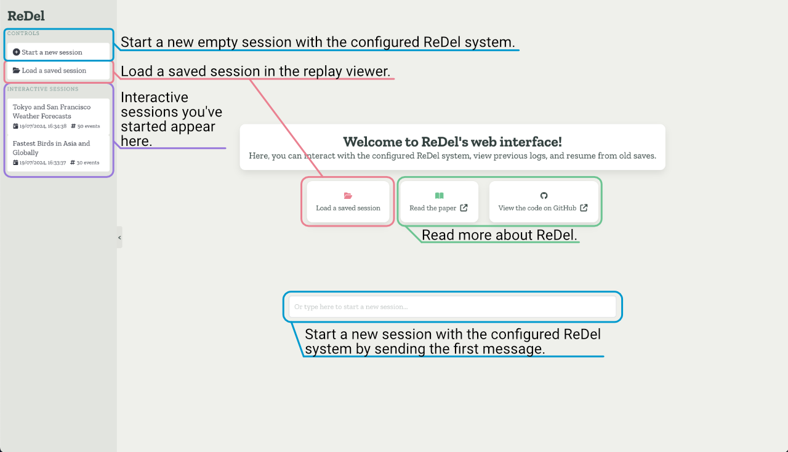
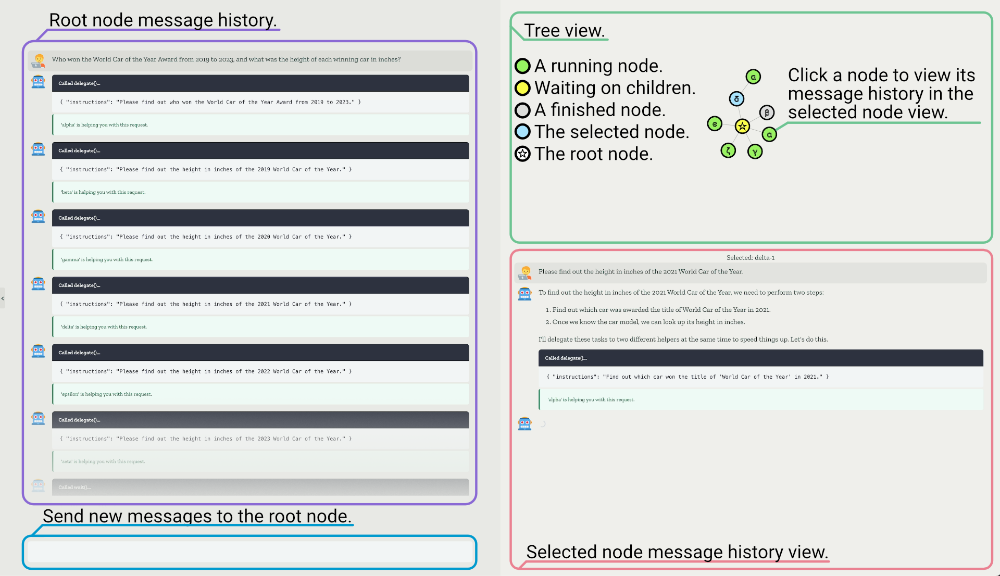
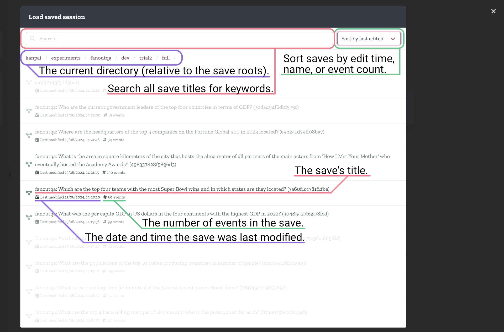
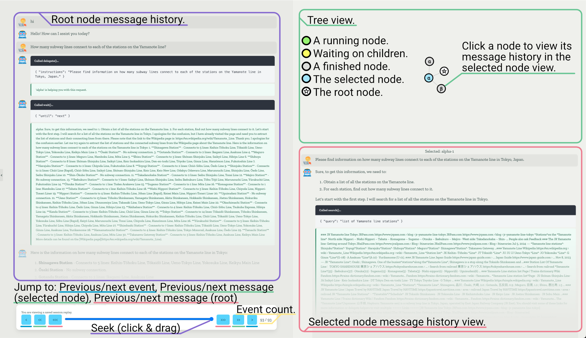

Web Interface
=============
The web interface allows you to interactively chat with a ReDel system you have configured, browse saved ReDel sessions,
and view full replays of a ReDel system with an intuitive visual interface. With the web interface, you can quickly
iterate on tools and prompts using the interactive mode, and debug your system's behaviour visually without having to
write any code.

In this section, we'll cover how to access the web interface, and walk through the different features and UI.

Getting Started
---------------
Basic Server
^^^^^^^^^^^^
The easiest way to get started with the web interface is by using:

.. code-block:: console

    $ python -m redel.server [--save-dir /path/to/dir ...]

This will launch the interactive server, hosting the web interface at http://127.0.0.1:8000.

Though this is a good way to quickly look at replays without having to configure a ReDel system, the default
configuration for the interactive system isn't capable of doing much! In fact, it has access to no tools and has
delegation disabled, so interactive sessions with this server are just a nice GPT-4o UI.

Custom Interactive System
^^^^^^^^^^^^^^^^^^^^^^^^^
To configure the interactive system with your own tools and delegation capabilities, you'll need to tell the server
what configuration to use. This means providing :class:`.VizServer` with a prototype ``ReDel`` instance:

.. code-block:: python
    :caption: An example of serving a ReDel configuration with web browsing over the web interface.

    from kani.engines.openai import OpenAIEngine
    from redel import ReDel
    from redel.server import VizServer
    from redel.tools.browsing import Browsing

    # configure the LLM(s) your system will use
    engine = OpenAIEngine(model="gpt-4o", temperature=0.8, top_p=0.95)

    # a ReDel session configuration
    proto = ReDel(
        # set your LLM engines...
        root_engine=engine,
        delegate_engine=engine,
        # and configure the tools you want to expose - see "ReDel" for more info
        tool_configs={
            Browsing: {"always_include": True},
        },
    )

    # pass that dict to VizServer
    server = VizServer(proto)

    # VizServer.serve() makes the web interface available at 127.0.0.1:8000 by default
    server.serve()

Each time you start a new interactive session in the web interface, the server will construct a *new* :class:`.ReDel`
instance with the same configuration as the given prototype.

.. note::
    For more control over how the server creates new ReDel instances, you can use the ``redel_factory`` argument instead
    -- see the :class:`.VizServer` documentation for more information.

Interface Walkthrough
---------------------
In this section, we'll show each part of the interface and what you can do on each page.

Home
^^^^
The home page is where you'll start most of the time. You can start a new interactive session by sending a message
in the chat bar, or use the provided buttons to load a saved replay or read more about ReDel.

The sidebar lets you switch between interactive sessions you've started (resets each time the server restarts), start
new sessions, or load saved replays. You can show or hide the sidebar by clicking on the drawer handle.

Interactive Session
^^^^^^^^^^^^^^^^^^^

In an interactive session, you can send messages to the root node to interact with the system. While the system is
running, you'll see the tree of all the agents spawned by the system in the top right, and what their current status is:
running, waiting, or done. Finally, you can click on a node to view its message state in the bottom right.

Every node comes with streaming, so you can see each agent work in real time!

Save Browser
^^^^^^^^^^^^

The save browser is how you can select a save to view in the replay viewer. The save list contains all the saves
that the ReDel server found in the provided save directories, their titles, number of
events, when they were last edited. If you searched for a term, it also shows the path the save was found at. Finally,
you can sort the saves by their name, edit time, or number of events.

If your save directories contain sub-directories, you can also navigate into those directories from the browser.

Replay Viewer
^^^^^^^^^^^^^

The replay viewer lets you replay the trajectory a ReDel system took to accomplish a task. It's similar to the
interactive session view, but instead of sending messages to the system, the message box is replaced by replay controls.

You can use these replay controls to jump between messages in the root node, selected node in the tree, or seek events
using the slider. The message history and tree view will update in real time as you seek through the replay.

.. video:: _static/replay.webm

Technical Details
-----------------
*You won't need to know these details to use the web interface, but if you're curious about how it works, read on!*

The web interface is built using Vue 3 (TS, SFC) and Bulma (SCSS). To communicate with the ReDel server, it primarily
uses a RESTful API exposed by the ``redel.server`` module. You can find a list of endpoints by visiting
http://127.0.0.1:8000/docs while the ReDel server is running.

The node graph is constructed by listening to events from the server (the same kind that are logged in the previous
section) over a WebSocket. Replays are constructed by implementing an ``undoEvent`` operation that effectively does
the opposite of what receiving an event does, and this allows the client to seek back and forth in history.

In theory, you could host ReDel over the internet using a server to provide the ReDel backend code and having clients
connect to the ReDel server. We won't stop you, but do note that the ReDel server implements no sort of authentication.
